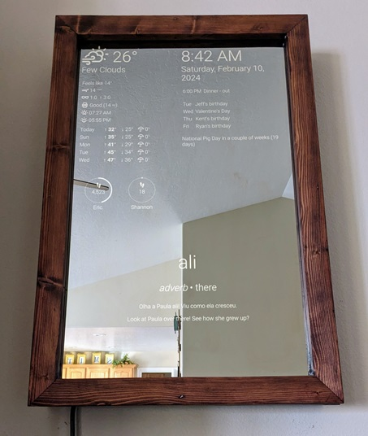

# mirror

Smart/Magic Mirror



Note: I'm not currently seeking extensive contributions on this project, mainly because
I want to be free to significantly change how it works without supporting an installed
base, but feel free to use it if it seems interesting to you.

## Raspberry Pi Setup

Using Raspberry Pi OS.

It will probably be helpful to enable ssh access, which can be done following
the [Remote Access
instructions](https://www.raspberrypi.org/documentation/computers/remote-access.html).

Install the unclutter package for hiding the mouse cursor, and the xdotool to
make it easier to refresh the browser from the command line.

    sudo apt-get install unclutter xdotool

You might want to rotate the display if your monitor is hung vertically. Edit
/boot/config.txt:

    sudo nano /boot/config.txt

Add a line to the end of the file:

    display_rotate=3

The value indicates the orientation:

| Value | Orientation |
| ----- | ----------- |
| 0     | Normal      |
| 1     | 90 degrees  |
| 2     | 180 degrees |
| 3     | 270 degrees |

Install docker following the instructions for Raspbian from the
[documentation](https://docs.docker.com/engine/install/debian/#install-using-the-convenience-script),
including adding your user to the `docker` group in the [post install
instructions](https://docs.docker.com/engine/install/linux-postinstall/).

Copy the mirror-server.service systemd service unit file from this repo and
enable it:

    sudo cp ~/mirror/system/mirror-server.service /etc/systemd/system/
    sudo systemctl enable mirror-server

Make a backup of your autostart file (just in case):

    sudo cp /etc/xdg/lxsession/LXDE-pi/autostart /etc/xdg/lxsession/LXDE-pi/autostart.bak

Copy the `autostart` file from the project:

    sudo cp ~/mirror/system/autostart /etc/xdg/lxsession/LXDE-pi/autostart

If you want, use the `scroff.sh` and `scron.sh` scripts in a cron job to
schedule when the screen will be off/on. Those need to be run by root. To edit
cron jobs, run:

    sudo crontab -e

For example, turn on at 5:45 AM, off at 11 PM, add these lines:

    45 5  * * * /home/pi/mirror/system/scron.sh
    0 23  * * * /home/pi/mirror/system/scroff.sh

https://www.raspberrypi.org/documentation/linux/usage/cron.md

You'll also need to create a `/home/pi/mirror/instance` directory, and
configure services as described below.

The software runs in a Docker container. You can run it the first time or update it
later with the `system/run.sh` script.

## Development

The mirror application is built with Python using Starlette and htmx.

Information on the mirror is provided by plugins. A plugin is a data source, plus one or
more widgets that specify how the data is displayed. More information about developing
plugins appears later in this document.

### Setup

Install [pdm](https://pdm.fming.dev/latest/), then:

    pdm install --dev

Run with either:

    pdm run mirror

or

    python3 src/mirror/main.py

The server runs on http://localhost:5000.

### Pre-commit hook

For tests, linting and other checks before commit:

    pdm run pre-commit install

## Mirror Configuration

Widgets can generally appear on the mirror in three zones: left and right, where all
widgets are shown all the time, and bottom, where widgets are rotated to display them
one at a time. The enabled widgets and their zone are configured in
instance/mirror.toml.

```toml
[widgets]
left = ["weather", "activity", "now_playing"]
right = ["clock", "calendars-agenda", "calendars-coming_up", "calendars-countdown"]
bottom = ["word_ptbr", "mail", "positivity"]
```

To do any configuration that plugins might need, run the config utility. This can be
done in a couple of ways:

In the development environment:

```
pdm run config
```

On device, when a Docker image exists:

```
~/mirror/system/config.sh
```

That will prompt you for any settings for all plugins, storing them well-obfuscated in
`instance/mirror.db`. Specific plugins can be configured using the `--plugins` switch.
For example:

```
pdm run mirror-config --plugins mail weather
```

Some configuration requires using a web browser (such as to handle OAuth), so you'll
either need to have a keyboard attached to the device, or you can do configuration on
another machine (like a desktop PC) and copy `instance/mirror.db` and
`instance/mirror.key` to the device.

## Plugins

Details about plugins requiring non-trivial configuration are explained below.

### Activity

Fitbit step count for the data.

1. Go to https://dev.fitbit.com/apps, logging in with your Fitbit account.
1. Click on "Register a new app"
1. Fill in the requested data. Most of the values before "OAuth 2.0 Application
   Type" will be used for the authorization prompt, so the values don't matter
   much.
1. For "OAuth 2.0 Application Type" choose "Personal"
1. For "Redirect URL" enter "http://localhost:5000/fitbit"
1. For "Default Access Type" choose "Read-Only"
1. After agreeing to terms, click "Register"
1. When that succeeds, click the "OAuth 2.0 tutorial page" link
1. For "Flow type" choose "Authorization Code Flow"
1. For "Select Scopes" check "activity"
1. There is a link below text saying, "We've generated the authorization URL
   for you, all you need to do is just click on link below:" Click it.
1. Your browser will go to the callback URL entered earlier (likely displaying
   an error), and will have a `code` query parameter like
   `?code=7b64c4b088b9c841d15bcac15d4aa7433d35af3e#_=`. Copy the
   `7b64c4b088b9c841d15bcac15d4aa7433d35af3e` part.
1. Run mirror-config, and enter the prompted values. For Authorization code,
   enter the value copied from the URL in the previous step.

Note: The authorization code can only be used once, so if something goes wrong, you may
need to generate a new one and re-run configuration to try again.

### Air Quality

AQI from AirNow.

Setup for this plugin requires an API key, which you can get
[here](https://docs.airnowapi.org/account/request/).

The config utility will prompt for your location.

### Calendars

Data from your Google Calendar.

You'll first need to set up access to the calendar API. You can do that from
[this page](https://goo.gl/5ao8u2) and clicking on "Enable the API".

Follow the prompts to get a client id json file. You'll need that when running
configure.py.

Scope: .../auth/calendar.events.readonly	View events on all your calendars

Application type: Desktop Application

Running configure.py will also launch your default browser so that you can
authorize the mirror application that you just set up for read-only access to
your Google Calendars.

The agenda shows events for today, and "all-day" events for the next week.
You can filter out some upcoming events with a regular expression. Events whose
summary matches the regular expression are *excluded*.

If you want to have calendar events farther out show up, you can put
"mirror-countdown" in them somewhere (probably the description makes the most
sense).

### Mail

You can send an email with "Mirror" in the subject (case-insensitive) and have that
appear on the mirror for a week. Usually that makes the most sense rotated with other
bottom widgets. The config utility will ask for IMAP settings. For example:

```python
IMAP_HOST = 'imap.gmail.com'
IMAP_PORT = 993
IMAP_USERNAME = 'somebody@sample.com'
IMAP_PASSWORD = 'mysecretpassword'
```

If you want to use a Gmail account, you'll need to enable IMAP in the Gmail settings.
Also, it might work best to use two-factor authentication and create an app
password for the mirror.

### Now Playing

Currently playing track from Spotify (requires a Spotify Premium account).

1. Create an app at Spotify's [Developer
   Dashboard](https://developer.spotify.com/dashboard/) following [these
   instructions](https://developer.spotify.com/documentation/general/guides/authorization/app-settings/).
   Use "http://localhost:5050/auth" for the redirect URI.
2. Run `mirror-config --plugins=now_playing` and follow the prompts.

### Weather

Current weather and forecasts using Open Weather Map.

## Sentry Logging

You can get a free "hobbyist" account at https://sentry.io. This will let you
get alerts if something goes wrong in the application.

Then add a SENTRY_CONFIG dictionary to `instance/config.py` like that shown in
the [documentation](https://docs.sentry.io/clients/python/integrations/flask/).

## Troubleshooting

If the browser doesn't show the right data when starting the Pi, it's likely
that the Python application had an exception while starting. You can check that
by ssh into the Pi and running:

    systemctl status mirror-server

Or, to see more logs:

    journalctl -u mirror-server

## Plugin development

A typical plugin has this structure:

```
mirror/plugins/my_plugin
    static
        my_plugin.css
        my_plugin.png
    __init__.py
    my_plugin.html
```

- The `static` directory has static assets needed for rendering, if any.
- The `__init__.py` module exposes the plugin interface to the mirror application. At
  minimum, the file must exist, but typically it will also expose any of these functions
  that it needs:
    - `configure_plugin` - Called by the config utility to prompt the user for config.
    - `start_plugin` - Called by the main mirror app at startup time.
    - `stop_plugin` - Called by the main mirror app at shutdown time.
- The `my_plugin.html` is the Jinja2 template to render the plugin's main widget.

Templates can use `url_for("my_plugin.png")` to reference a file in the plugin's static
directory. This is **not** the same `url_for` provided by Starlette.

By convention, to avoid style conflicts, use #my_plugin scoping on CSS selectors. For
example:

```css
#my_plugin p { color: white; }
```

Return no markup if a widget doesn't have anything to display (for example, the mail
plugin does this is there aren't any emails). Especially with the bottom zone, the
widget is skipped while rotating if there is nothing to show, rather than being blank
for the rotation period.

The mirror application provides some services to plugins via the `PluginContext` class,
such as the ability to read and write persistent config data. A plugin should call the
`PluginContext.widget_updated` when its data has been updated such that one of its
widgets would display differently.

You can look at the existing plugins for examples of how things work, including:

- The `calendars` plugin, which has multiple widgets.
- The `weather` plugin, which embeds another plugin's widget (`air_quality`).
- The `positivity` plugin, which has multiple messages that rotate each time the
  plugin itself is rotated.
